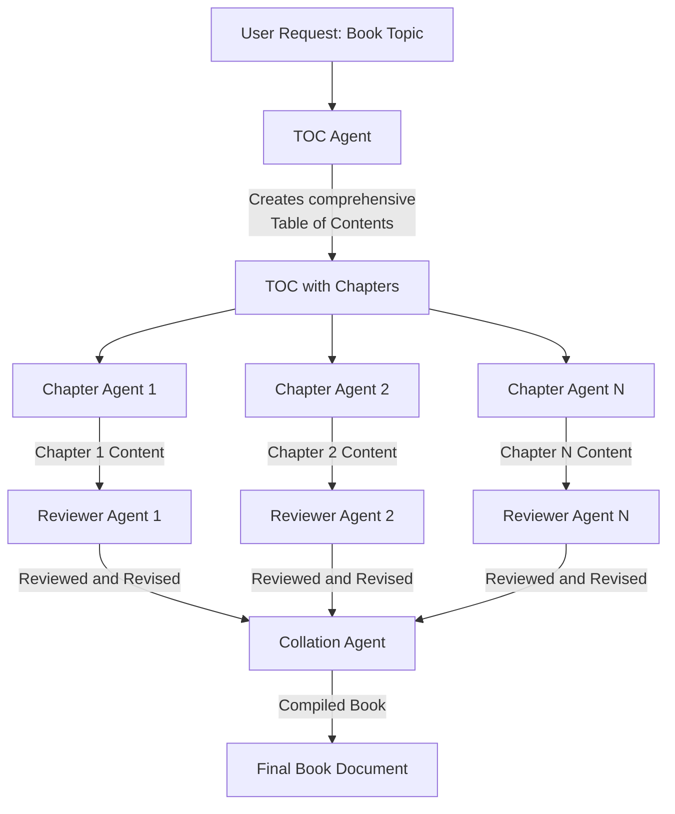

# Book Agent
This project demonstrates how to create a book agent using the Google ADK. The book agent is designed to generate comprehensive content on a specific topic, organize it into chapters, and ensure that the information is accurate and well-structured.

> **Note:** This agent uses the shared SDK located at `/sdk` in the workspace root. The SDK provides agent factories, registries, and utilities that can be used by any agent in the workspace.

## Agent Architecture

### Architecture Flow

1. **TOC Agent** - Takes the user's book topic request and creates a comprehensive Table of Contents with all chapters

2. **Chapter Agents** - Multiple specialized agents that work in parallel, each picking up one chapter from the TOC and creating comprehensive content

3. **Reviewer Agents** - Each chapter's output is reviewed by a reviewer agent that revises and improves the content

4. **Collation Agent** - Collects all the reviewed chapter contents and compiles them into a single, cohesive book document
